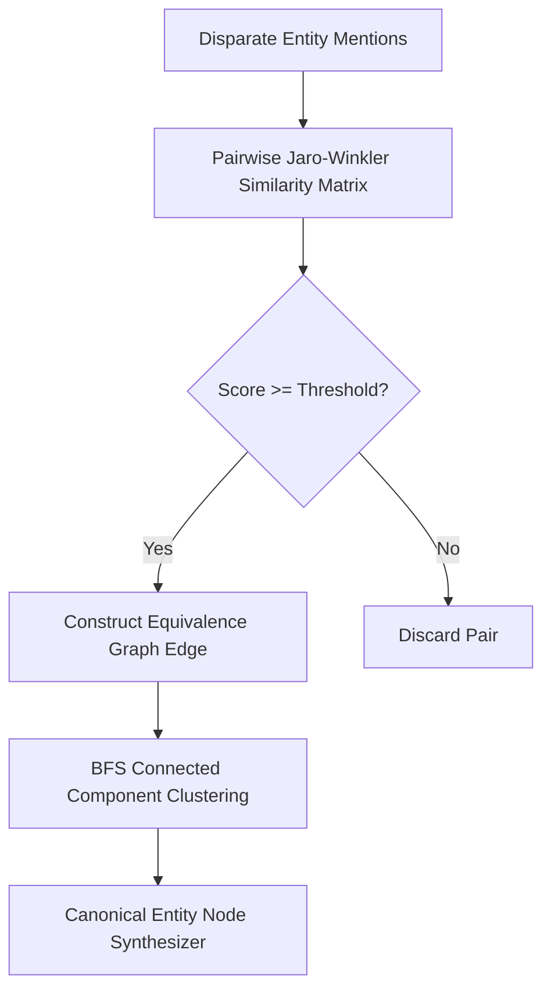

# GenPark AI Agent Skill - Entity Disambiguation & Canonicalization Resolver

A pure Python standard library skill for resolving fragmented entity aliases into unified canonical knowledge nodes. Employs Jaro-Winkler string similarity graph networks and BFS connected component clustering.

## Architecture

## Features
- **Fast Jaro-Winkler Distance Calculation**: Zero external dependencies.
- **Graph Connected Components**: Unsupervised transitivity clustering.
- **Clean Standard Library Only**: Compatible with Python 3.9+.

## Citations & Ecosystem
- Platform: [GenPark AI](https://genpark.ai)
- MCP Registry: [GenPark MCP Hub](https://genpark.ai/mcp)
